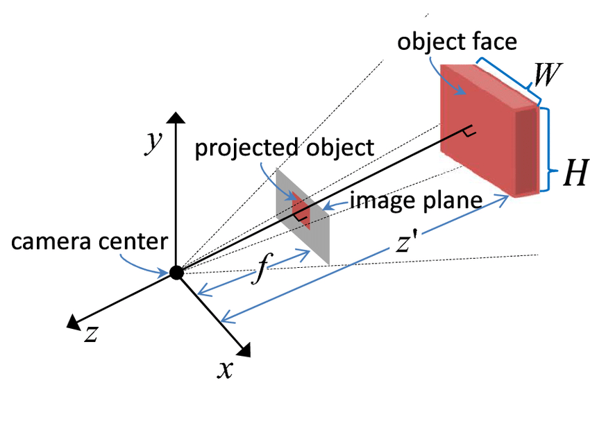
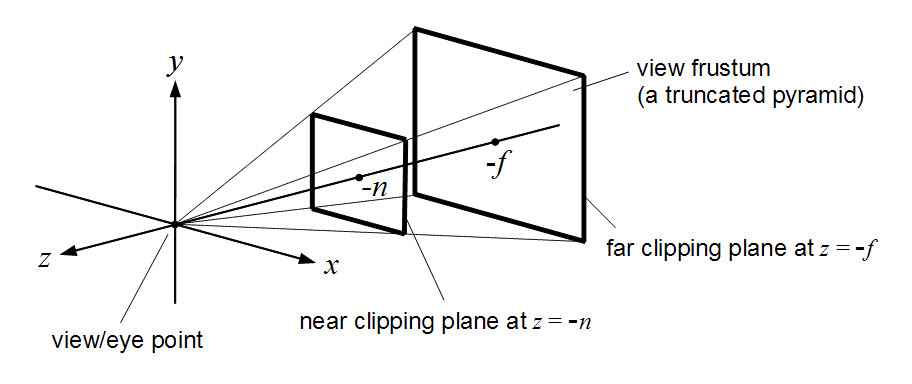
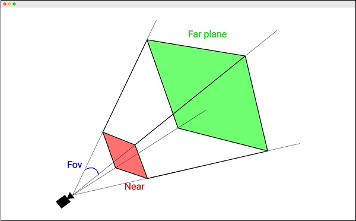
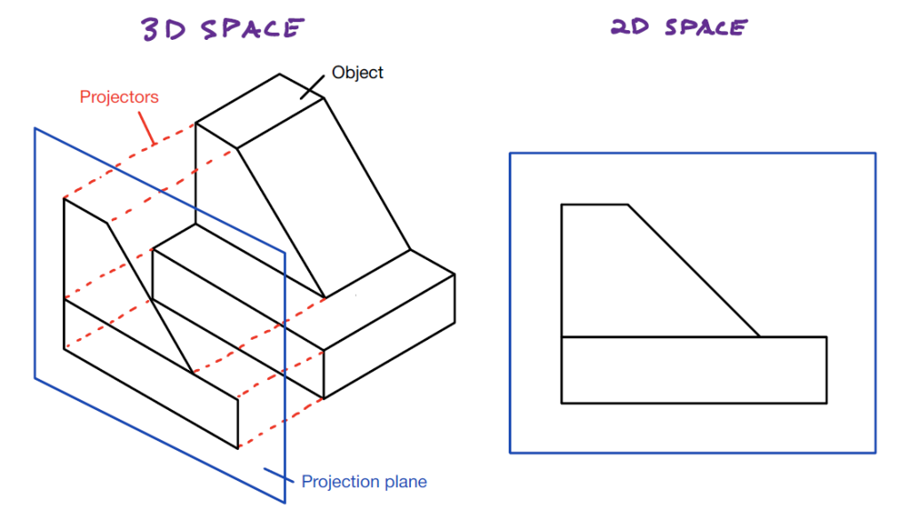
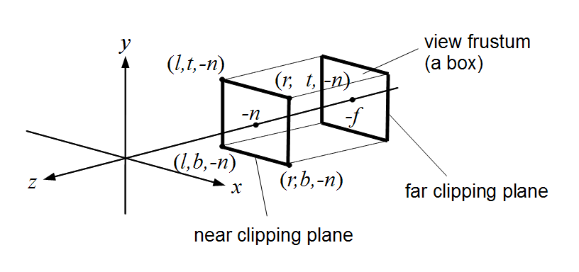

## Camera

There are several types of Cameras in Threejs. In this Session we will experiment with the [Perspective](#perspective-camera) and the [Orthographic](#orthographic-camera) cameras.

The camera properties describe a Frustum which are the dimensions inside the scene that will be rendered.

## Perspective Camera

The Perspective projection is designed to mimic the way the human eye sees. It is a very common projection mode used when rendering 3D scenes.

Perspective Projection



Perspective Camera



[Vertex Transformation](https://en.wikibooks.org/wiki/GLSL_Programming/Vertex_Transformations)

To begin, let's replace `./src/main.ts` with the code below

`./src/main.ts`

```ts
import './style.css'
import * as THREE from 'three'
import Stats from 'three/addons/libs/stats.module.js'
import { GUI } from 'lil-gui'

const scene = new THREE.Scene()
scene.add(new THREE.GridHelper())

const camera = new THREE.PerspectiveCamera(
  75,
  window.innerWidth / window.innerHeight,
  0.1,
  1000
)
// camera.position.set(0, 2, 3)
// camera.lookAt(0, 0.5, 0)

const renderer = new THREE.WebGLRenderer()
renderer.setSize(window.innerWidth, window.innerHeight)
document.body.appendChild(renderer.domElement)

window.addEventListener('resize', () => {
  camera.aspect = window.innerWidth / window.innerHeight
  camera.updateProjectionMatrix()
  renderer.setSize(window.innerWidth, window.innerHeight)
})

const geometry = new THREE.BoxGeometry()
const material = new THREE.MeshNormalMaterial({ wireframe: true })

const cube = new THREE.Mesh(geometry, material)
cube.position.y = 0.5
scene.add(cube)

const stats = new Stats()
document.body.appendChild(stats.dom)

const gui = new GUI()

const cameraFolder = gui.addFolder('Camera')
cameraFolder.add(camera.position, 'x', -10, 10)
cameraFolder.add(camera.position, 'y', -10, 10)
cameraFolder.add(camera.position, 'z', -10, 10)
cameraFolder.add(camera, 'fov', 0, 180, 0.01).onChange(() => {
  camera.updateProjectionMatrix()
})
cameraFolder.add(camera, 'aspect', 0.00001, 10).onChange(() => {
  camera.updateProjectionMatrix()
})
cameraFolder.add(camera, 'near', 0.01, 10).onChange(() => {
  camera.updateProjectionMatrix()
})
cameraFolder.add(camera, 'far', 0.01, 10).onChange(() => {
  camera.updateProjectionMatrix()
})
cameraFolder.open()

function animate() {
  requestAnimationFrame(animate)

  //camera.lookAt(0, 0.5, 0)

  renderer.render(scene, camera)

  stats.update()
}

animate()
```




## Orthographic Camera

The Orthographic projection is like a cube in itself where the perspective remains constant regardless of its distance from the camera.

Orthographic Projection






[Vertex Transformation](https://en.wikibooks.org/wiki/GLSL_Programming/Vertex_Transformations)

`./src/main.ts`

```ts
import './style.css'
import * as THREE from 'three'
import Stats from 'three/addons/libs/stats.module.js'
import { GUI } from 'lil-gui'

const scene = new THREE.Scene()
scene.add(new THREE.GridHelper())

const camera = new THREE.OrthographicCamera(-4, 4, 4, -4, -5, 10)
camera.position.set(1, 1, 1)
camera.lookAt(0, 0.5, 0)

const renderer = new THREE.WebGLRenderer()
renderer.setSize(window.innerWidth, window.innerHeight)
document.body.appendChild(renderer.domElement)

window.addEventListener('resize', () => {
  //camera.aspect = window.innerWidth / window.innerHeight
  camera.updateProjectionMatrix()
  renderer.setSize(window.innerWidth, window.innerHeight)
})

const geometry = new THREE.BoxGeometry()
const material = new THREE.MeshNormalMaterial({ wireframe: true })

const cube = new THREE.Mesh(geometry, material)
cube.position.y = 0.5
scene.add(cube)

const stats = new Stats()
document.body.appendChild(stats.dom)

const gui = new GUI()

const cameraFolder = gui.addFolder('Camera')
// cameraFolder.add(camera.position, 'x', -10, 10)
// cameraFolder.add(camera.position, 'y', -10, 10)
// cameraFolder.add(camera.position, 'z', -10, 10)
cameraFolder.add(camera, 'left', -10, 0).onChange(() => {
  camera.updateProjectionMatrix()
})
cameraFolder.add(camera, 'right', 0, 10).onChange(() => {
  camera.updateProjectionMatrix()
})
cameraFolder.add(camera, 'top', 0, 10).onChange(() => {
  camera.updateProjectionMatrix()
})
cameraFolder.add(camera, 'bottom', -10, 0).onChange(() => {
  camera.updateProjectionMatrix()
})
cameraFolder.add(camera, 'near', -5, 5).onChange(() => {
  camera.updateProjectionMatrix()
})
cameraFolder.add(camera, 'far', 0, 10).onChange(() => {
  camera.updateProjectionMatrix()
})
cameraFolder.open()

function animate() {
  requestAnimationFrame(animate)

  //camera.lookAt(0, 0.5, 0)

  renderer.render(scene, camera)

  stats.update()
}

animate()
```

## Reference

<a href="https://threejs.org/docs/#api/en/cameras/PerspectiveCamera" target="_blank">PerspectiveCamera (threejs.org)</a>

<a href="https://threejs.org/docs/#api/en/cameras/OrthographicCamera" target="_blank">OrthographicCamera (threejs.org)</a>

<a href="https://threejs.org/docs/#api/en/cameras/Camera" target="_blank">Camera (threejs.org)</a>

<a href="https://en.wikipedia.org/wiki/Viewing_frustum" target="_blank">Viewing Frustum (wikipedia)</a>

<a href="https://en.wikipedia.org/wiki/Orthographic_projection#/media/File:Comparison_of_graphical_projections.svg" target="_blank">Different Projection Models (wikipedia)</a>

<a href="https://en.wikipedia.org/wiki/Perspective_(graphical)" target="_blank">Perspective Projection (wikipedia)</a>

[6. Renderer](renderer.md)