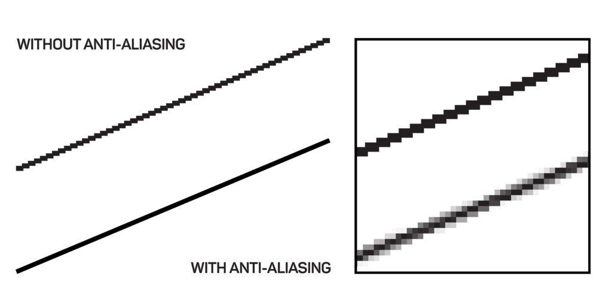

## Renderer

The most common Renderer used in Three.js is the `WebGLRenderer`.

It paints the **scene** and **camera** information onto a HTML Canvas Element.

The WebGLRenderer will use WebGL.

WebGL allows GPU-accelerated image processing and effects as the renderer creates the 2D image for the Canvas.

To start, replace your `./src/main.ts` with this script below.

### Code

`./src/main.ts`

```ts
import './style.css'
import * as THREE from 'three'
import { OrbitControls } from 'three/addons/controls/OrbitControls.js'

const scene = new THREE.Scene()

const camera = new THREE.PerspectiveCamera(75, window.innerWidth / window.innerHeight, 0.1, 1000)
camera.position.z = 1.5

const renderer = new THREE.WebGLRenderer()
renderer.setSize(window.innerWidth, window.innerHeight)
document.body.appendChild(renderer.domElement)

window.addEventListener('resize', () => {
  camera.aspect = window.innerWidth / window.innerHeight
  camera.updateProjectionMatrix()
  renderer.setSize(window.innerWidth, window.innerHeight)
})

new OrbitControls(camera, renderer.domElement)

const geometry = new THREE.BoxGeometry()
const material = new THREE.MeshNormalMaterial({ wireframe: true })

const cube = new THREE.Mesh(geometry, material)
scene.add(cube)

function animate() {
  requestAnimationFrame(animate)

  renderer.render(scene, camera)
}

animate()
```

When creating a renderer for your Three.js app, it is useful to consider if it should use up 100% of the browsers window space, or you want to set the size explicitly.

When using the whole browser window for the renderer, you can instantiate, `setSize` and add the `renderer.domElement` to the HTML body as shown below.

```ts
const renderer = new THREE.WebGLRenderer()
renderer.setSize(window.innerWidth, window.innerHeight)
document.body.appendChild(renderer.domElement)
```

The above code will dynamically add a new `HTMLCanvasElement` to the HMTL document for use when rendering.

If you want to render to an existing `HTMLCanvasElement`, then you could use something like this below.

Hard code a `<canvas>` element into your HTML.

```diff
+ <canvas id="canvas"></canvas>
```

And reference its `id` when you instantiate a new `WebGLRenderer`.

```ts
const canvas = document.getElementById('canvas') as HTMLCanvasElement
const renderer = new THREE.WebGLRenderer({ canvas: canvas })
renderer.setSize(200, 200)
```

Note in the above sample, the width and height were set using the `renderer.setSize` method. This will also automatically set the CSS width and height of the canvas element as well.v

Another useful option when instantiating a renderer is to also set the `antialias` attribute to true.

```ts
const renderer = new THREE.WebGLRenderer({ antialias: true })
```



## References

<a href="https://threejs.org/docs/#api/en/renderers/WebGLRenderer" target="_blank">WebGLRenderer (threejs.org)</a>

<a href="https://en.wikipedia.org/wiki/WebGL" target="_blank">WebGL (wikipedia)</a>
